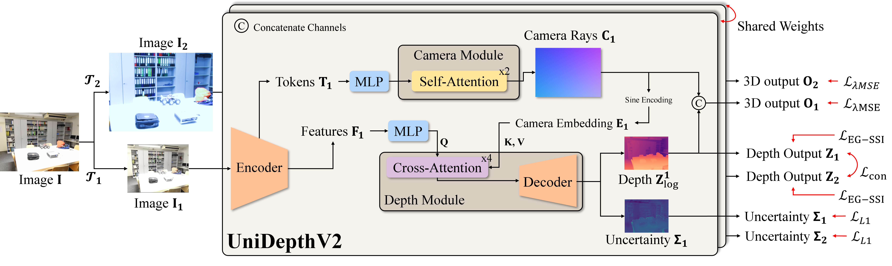
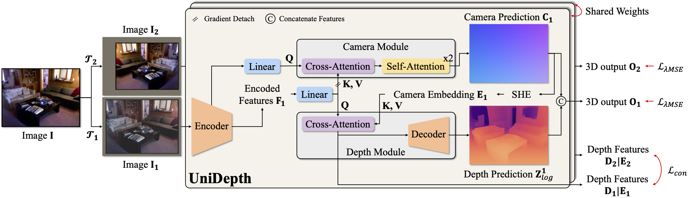
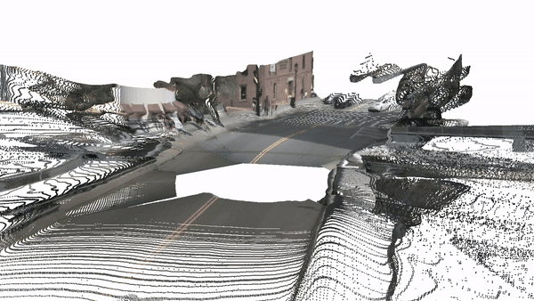

[](https://arxiv.org/abs/2502.20110)
[](https://arxiv.org/abs/2403.18913)
[](https://lpiccinelli-eth.github.io/pub/unidepth/)

# UniDepthV2: Universal Monocular Metric Depth Estimation Made Simpler

[-orange)](https://www.cvlibs.net/datasets/kitti/eval_depth.php?benchmark=depth_prediction)
[](https://paperswithcode.com/sota/monocular-depth-estimation-on-nyu-depth-v2?p=unidepthv2-universal-monocular-metric-depth)
[](https://paperswithcode.com/sota/monocular-depth-estimation-on-kitti-eigen?p=unidepthv2-universal-monocular-metric-depth)




> [**UniDepthV2: Universal Monocular Metric Depth Estimation Made Simpler**](https://arxiv.org/abs/2502.20110),  
> Luigi Piccinelli, Christos Sakaridis, Yung-Hsu Yang, Mattia Segu, Siyuan Li, Wim Abbeloos, Luc Van Gool,  
> under submission,  
> *Paper at [arXiv 2502.20110](https://arxiv.org/abs/2502.20110.pdf)*  


# UniDepth: Universal Monocular Metric Depth Estimation

[-orange)](https://www.cvlibs.net/datasets/kitti/eval_depth.php?benchmark=depth_prediction)
[](https://paperswithcode.com/sota/monocular-depth-estimation-on-nyu-depth-v2?p=unidepth-universal-monocular-metric-depth)
[](https://paperswithcode.com/sota/monocular-depth-estimation-on-kitti-eigen?p=unidepth-universal-monocular-metric-depth)



> [**UniDepth: Universal Monocular Metric Depth Estimation**](https://arxiv.org/abs/2403.18913),  
> Luigi Piccinelli, Yung-Hsu Yang, Christos Sakaridis, Mattia Segu, Siyuan Li, Luc Van Gool, Fisher Yu,  
> CVPR 2024,  
> *Paper at [arXiv 2403.18913](https://arxiv.org/pdf/2403.18913.pdf)*  


## News and ToDo

- [ ] HuggingFace/Gradio demo.
- [x] `28.02.2025`: Release UniDepthV2.
- [x] `15.10.2024`: Release training code.
- [x] `02.04.2024`: Release UniDepth as python package.
- [x] `01.04.2024`: Inference code and V1 models are released.
- [x] `26.02.2024`: UniDepth is accepted at CVPR 2024! (Highlight :star:)


## Zero-Shot Visualization

### YouTube (The Office - Parkour)
<p align="center">
  
</p>

### NuScenes (stitched cameras)
<p align="center">
  
</p>


## Installation

Requirements are not in principle hard requirements, but there might be some differences (not tested):
- Linux
- Python 3.10+ 
- CUDA 11.8+

Install the environment needed to run UniDepth with:
```shell
export VENV_DIR=<YOUR-VENVS-DIR>
export NAME=Unidepth

python -m venv $VENV_DIR/$NAME
source $VENV_DIR/$NAME/bin/activate

# Install UniDepth and dependencies
pip install -e . --extra-index-url https://download.pytorch.org/whl/cu118

# Install Pillow-SIMD (Optional)
pip uninstall pillow
CC="cc -mavx2" pip install -U --force-reinstall pillow-simd

# Install KNN (for evaluation only)
cd unidepth/ops/knn && bash compile.sh
```

If you use conda, you should change the following: 
```shell
python -m venv $VENV_DIR/$NAME -> conda create -n $NAME python=3.11
source $VENV_DIR/$NAME/bin/activate -> conda activate $NAME
```

*Note*: Make sure that your compilation CUDA version and runtime CUDA version match.  
You can check the supported CUDA version for precompiled packages on the [PyTorch website](https://pytorch.org/).

*Note*: xFormers may raise the the Runtime "error": `Triton Error [CUDA]: device kernel image is invalid`.  
This is related to xFormers mismatching system-wide CUDA and CUDA shipped with torch.  
It may considerably slow down inference.

Run UniDepth on the given assets to test your installation (you can check this script as guideline for further usage):
```shell
python ./scripts/demo.py
```
If everything runs correctly, `demo.py` should print: `ARel: 7.45%`.

If you encounter `Segmentation Fault` after running the demo, you may need to uninstall torch via pip (`pip uninstall torch`) and install the torch version present in [requirements](requirements.txt) with `conda`.

## Get Started

After installing the dependencies, you can load the pre-trained models easily from [Hugging Face](https://huggingface.co/models?other=UniDepth) as follows:

```python
from unidepth.models import UniDepthV1

model = UniDepthV1.from_pretrained("lpiccinelli/unidepth-v1-vitl14") # or "lpiccinelli/unidepth-v1-cnvnxtl" for the ConvNext backbone
```

Then you can generate the metric depth estimation and intrinsics prediction directly from RGB image only as follows:

```python
import numpy as np
from PIL import Image

# Move to CUDA, if any
device = torch.device("cuda" if torch.cuda.is_available() else "cpu")
model = model.to(device)

# Load the RGB image and the normalization will be taken care of by the model
rgb = torch.from_numpy(np.array(Image.open(image_path))).permute(2, 0, 1) # C, H, W

predictions = model.infer(rgb)

# Metric Depth Estimation
depth = predictions["depth"]

# Point Cloud in Camera Coordinate
xyz = predictions["points"]

# Intrinsics Prediction
intrinsics = predictions["intrinsics"]
```

You can use ground truth intrinsics as input to the model as well:
```python
intrinsics_path = "assets/demo/intrinsics.npy"

# Load the intrinsics if available
intrinsics = torch.from_numpy(np.load(intrinsics_path)) # 3 x 3

# For V2, we defined camera classes. If you pass a 3x3 tensor (as above)
# it will convert to Pinhole, but you can pass classes from camera.py.
# The `Camera` class is meant as an abstract, use only child classes as e.g.:
from unidepth.utils.camera import Pinhole, Fisheye624

camera = Pinhole(K=intrinsics) # pinhole 
# fill in fisheye, params: fx,fy,cx,cy,d1,d2,d3,d4,d5,d6,t1,t2,s1,s2,s3,s4
camera = Fisheye624(params=torch.tensor([...]))
predictions = model.infer(rgb, camera)
```

To use the forward method for your custom training, you should:  
1) Take care of the dataloading:  
  a) ImageNet-normalization  
  b) Long-edge based resizing (and padding) with input shape provided in `image_shape` under configs  
  c) `BxCxHxW` format  
  d) If any intriniscs given, adapt them accordingly to your resizing  
2) Format the input data structure as:  
```python
data = {"image": rgb, "K": intrinsics}
predictions = model(data, {})
```

## Model Zoo

The available models are the following:

<table border="0">
    <tr>
        <th>Model</th>
        <th>Backbone</th>
        <th>Name</th>
    </tr>
    <tr>
        <td rowspan="2"><b>UnidepthV1</b></td>
        <td>ConvNext-L</td>
        <td><a href="https://huggingface.co/lpiccinelli/unidepth-v1-cnvnxtl">unidepth-v1-cnvnxtl</a></td>
    </tr>
    <tr>
        <td>ViT-L</td>
        <td><a href="https://huggingface.co/lpiccinelli/unidepth-v1-vitl14">unidepth-v1-vitl14</a></td>
    </tr>
    <hr style="border: 2px solid black;">
    <tr>
        <td rowspan="3"><b>UnidepthV2</b></td>
        <td>ViT-S</td>
        <td><a href="https://huggingface.co/lpiccinelli/unidepth-v2-vits14">unidepth-v2-vits14</a></td>
    </tr>
    <tr>
        <td>ViT-B</td>
        <td><a href="https://huggingface.co/lpiccinelli/unidepth-v2-vitb14">unidepth-v2-vits14</a></td>
    </tr>
    <tr>
        <td>ViT-L</td>
        <td><a href="https://huggingface.co/lpiccinelli/unidepth-v2-vitl14">unidepth-v2-vitl14</a></td>
    </tr>
</table>

Please visit [Hugging Face](https://huggingface.co/lpiccinelli) or click on the links above to access the repo models with weights.
You can load UniDepth as the following, with `name` variable matching the table above:

```python
from unidepth.models import UniDepthV1, UniDepthV2

model_v1 = UniDepthV1.from_pretrained(f"lpiccinelli/{name}")
model_v2 = UniDepthV2.from_pretrained(f"lpiccinelli/{name}")
```

In addition, we provide loading from TorchHub as:

```python
version = "v2"
backbone = "vitl14"

model = torch.hub.load("lpiccinelli-eth/UniDepth", "UniDepth", version=version, backbone=backbone, pretrained=True, trust_repo=True, force_reload=True)
```

You can look into function `UniDepth` in [hubconf.py](hubconf.py) to see how to instantiate the model from local file: provide a local `path` in line 34.


## UniDepthV2

Visit [UniDepthV2 ReadMe](assets/docs/V2_README.md) for a more detailed changelog.
To summarize the main differences are:
- Improved performance and edge sharpness. (`EdgeGuidedLocalSSI`)
- Input shape and ratio flexibility. (`self.resolution_level`)
- Confidence output.
- Faster inference.
- ONNX support.
- New cameras support (see `camera.py`).

UnidepthV2old is actually V1 version updated to compensate for wave artifacts due to wrong LiDAR accumulation.

## Training

Please [visit the training README](scripts/README.md) for more information.


## Results

### Metric Depth Estimation
The performance reported is for UniDepthV1 model and the metrics is d1 (higher is better) on zero-shot evaluation. The common split between SUN-RGBD and NYUv2 is removed from SUN-RGBD validation set for evaluation. 

| Model | NYUv2 | SUN-RGBD | ETH3D | Diode (In) | IBims-1 | KITTI | Nuscenes | DDAD | 
| :-: | :-: | :-: | :-: | :-: | :-: | :-: | :-: | :-: |
| iDisc | 93.8 | 83.7 | 35.6 | 23.8 | 48.9 | 97.5 | 39.4 | 28.4 |
| ZoeDepth | 95.2 | 86.7 | 35.0 | 36.9 | 58.0 | 96.5 | 28.3 | 27.2 |
| Metric3D | 92.6 | 15.4 | 45.6 | 39.2 | 79.7 | 97.5 | 72.3 | - |
| Metric3Dv2 | 98.9 | 81.2 | 90.0 | - | 68.4 | 98.5 | 84.1 | - |
| DepthPro | - | 83.1 | 39.7 | - | 82.3 | - | 56.6 | 29.9 |
| UniDepthV1 | 98.4 | 94.3 | 18.5 | 77.1 | 15.7 | 98.6 | 84.6 | 85.8 |
| UniDepthV2 | 98.8 | 96.4 | 85.2 | - | 94.5 | 98.9 | 87.0 | 88.2 |


## Contributions

If you find any bug in the code, please report to Luigi Piccinelli (lpiccinelli@ethz.ch)


## Citation

If you find our work useful in your research please consider citing our publications:
```bibtex
@inproceedings{piccinelli2024unidepth,
    title     = {{U}ni{D}epth: Universal Monocular Metric Depth Estimation},
    author    = {Piccinelli, Luigi and Yang, Yung-Hsu and Sakaridis, Christos and Segu, Mattia and Li, Siyuan and Van Gool, Luc and Yu, Fisher},
    booktitle = {Proceedings of the IEEE/CVF Conference on Computer Vision and Pattern Recognition (CVPR)},
    year      = {2024}
}
```

```bibtex
@misc{piccinelli2025unidepthv2,
      title={{U}ni{D}epth{V2}: Universal Monocular Metric Depth Estimation Made Simpler}, 
      author={Luigi Piccinelli and Christos Sakaridis and Yung-Hsu Yang and Mattia Segu and Siyuan Li and Wim Abbeloos and Luc Van Gool},
      year={2025},
      eprint={2502.20110},
      archivePrefix={arXiv},
      primaryClass={cs.CV},
      url={https://arxiv.org/abs/2502.20110}, 
}
```

## License

This software is released under Creatives Common BY-NC 4.0 license. You can view a license summary [here](LICENSE).


## Acknowledgement

We would like to express our gratitude to [@niels](https://huggingface.co/nielsr) for helping intergrating UniDepth in HuggingFace.

This work is funded by Toyota Motor Europe via the research project [TRACE-Zurich](https://trace.ethz.ch) (Toyota Research on Automated Cars Europe).
